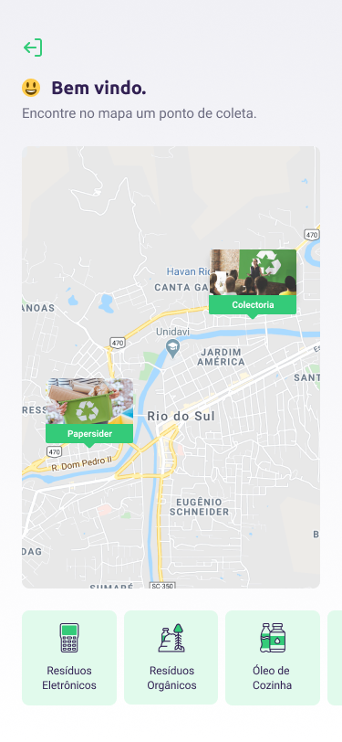

# Ecoleta - NLW - 01

## :recycle: Sobre o projeto

Ecoleta é uma aplicação que auxilia pessoas a encontrar rapidamente estabelecimentos com pontos de coleta de residuos cadastrados em sua cidade ou em qualquer lugar do mundo.

As empresas podem se cadastrar através da aplicação Web fornecendo as seguintes informações:

- Imagem do ponto de coleta
- Nome, email e whatsapp da empresa
- Local do estabelicimento
- Itens coletados pela empresa, sendo eles:

  + Lâmpadas
  + Pilhas e baterias
  + Papéis e papelão
  + Resíduos eletrônicos
  + Resíduos orgânicos
  + Óleo de cozinha

Os usuários terão acesso ao aplicativo mobile onde poderão:

- Filtrar o estado e a cidade para encontrar pontos de coletas mais próximos
- Filtar o estabelicimento por tipos de residuos coletados
- Entrar em contato com o estabelecimento via E-mail ou WhatsApp

Este projeto foi desenvolvido durante a **Next Level Week 01 (NLW)** organizada e disponibilizada pela [Rocketseat](https://rocketseat.com.br/). A **NLW** é um evento 100% online e gratuito para dar o próximo passo na evolução como programadora ou programador.

## :pencil2: Design

### :iphone: Mobile

  

### :computer: Web

## :computer: Tecnologias utilizadas

### Resumo

- Banco de Dados: [SQLite](https://www.sqlite.org/index.html)
- Front-End: [React](https://pt-br.reactjs.org/)
- Back-End: [Typescript](https://www.typescriptlang.org/)
- Mobile: [React Native](https://reactnative.dev/)

### Web

- [Axios](https://github.com/axios/axios)
- [Leaflet](https://leafletjs.com/)
- [React Dropzone](https://github.com/react-dropzone/react-dropzone)
- [React Icons](https://react-icons.github.io/react-icons/)
- [React Leaflet](https://react-leaflet.js.org/)
- [React Router Dom](https://github.com/ReactTraining/react-router/tree/master/packages/react-router-dom)

### Mobile 

- [Axios](https://github.com/axios/axios)
- [Expo](https://expo.io/)
- [Expo Constants](https://docs.expo.io/versions/latest/sdk/constants/)
- [Expo Google Fonts](https://github.com/expo/google-fonts)
- [Expo Location](https://docs.expo.io/versions/latest/sdk/location/)
- [Expo Mail Composer](https://docs.expo.io/versions/latest/sdk/mail-composer/)
- [React Navigation](https://reactnavigation.org/)
- [React Native Maps](https://github.com/react-native-community/react-native-maps)
- [React Native SVG](https://github.com/react-native-community/react-native-svg)

### Server

- [Celebrate](https://github.com/arb/celebrate)
- [CORS](https://expressjs.com/en/resources/middleware/cors.html)
- [dotENV](https://github.com/motdotla/dotenv)
- [Express](https://expressjs.com/)
- [Joi](https://github.com/sideway/joi)
- [KnexJS](http://knexjs.org/)
- [Multer](https://github.com/expressjs/multer)
- [ts-node](https://github.com/TypeStrong/ts-node)
- [SQLite](https://www.sqlite.org/index.html)

### Outros

- API: [IBGE API](https://servicodados.ibge.gov.br/api/docs/localidades?versao=1)
- Mapas: [Leaflet (web)](https://leafletjs.com/), GoogleMaps (mobile)
- Ícones: [Feather Icons](https://feathericons.com/), [Font Awesome](https://fontawesome.com/)
- Fontes: [Ubuntu, Roboto](https://fonts.google.com/?sidebar.open=true&selection.family=Roboto:wght@500|Ubuntu:wght@500&preview.text=Ecoleta&preview.text_type=custom)

## :arrow_forward: Executando o projeto

:construction: Em construção :construction:
